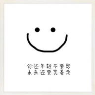

# logo-design

> How to Design My logo? Continuous design logo

## My logo history

### 6th

### 5th

### 4th

### 3rd

### 2nd

### 1st

## 设计思路

1. 确定文字：yidajiabei
2. 决定文字样式（镂空，渐变色，互补图形）
3. 决定文字状态（立体，弯曲）
4. 颜色选择：灰色，白色，不用黑色

## References

- [oooooohmygosh - 如何设计属于自己的标志](https://www.bilibili.com/video/BV1aT4y1w7yL) video
- [LOGO设计《收藏这个专题，不想学会都难！》](https://www.uisdc.com/20-logo-design-thoughts) post
