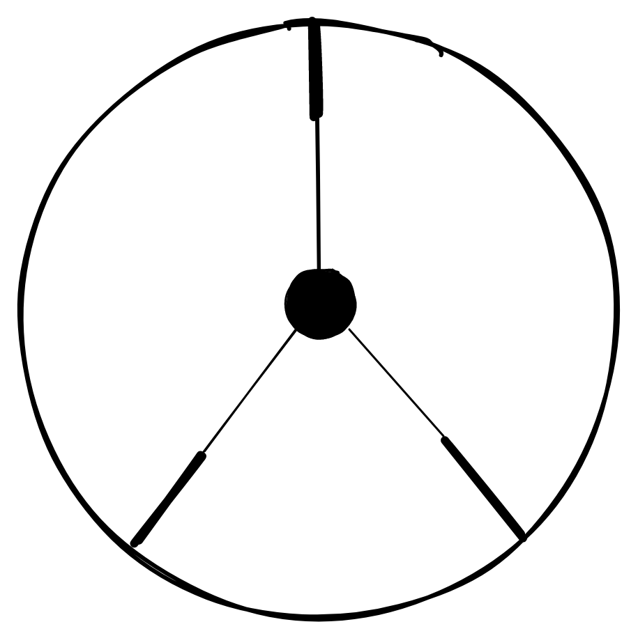
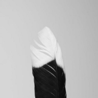
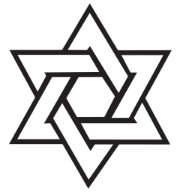
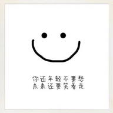

# logo-design

> How to Design My logo? Continuous design logo

## 设计思路

1. 无文字/无明显文字（即可由图形表达文字含义）~~确定文字：yidajiabei~~
2. 具有象征意义

## My logo history

### 8th

from <https://www.pngwing.com/en/free-png-itvly>

### 7th

### 6th

### 5th

### 4th

### 3rd

### 2nd

### 1st

---

1. Generate favicon for Site

- <https://favicon.io/favicon-converter/>
- <https://www.favicon-generator.org/>

2. References

- [oooooohmygosh - 如何设计属于自己的标志](https://www.bilibili.com/video/BV1aT4y1w7yL) video
- [LOGO设计《收藏这个专题，不想学会都难！》](https://www.uisdc.com/20-logo-design-thoughts) post
